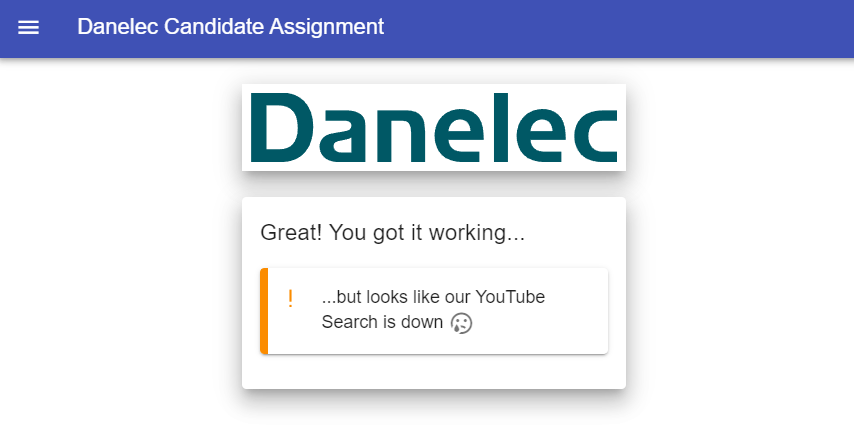
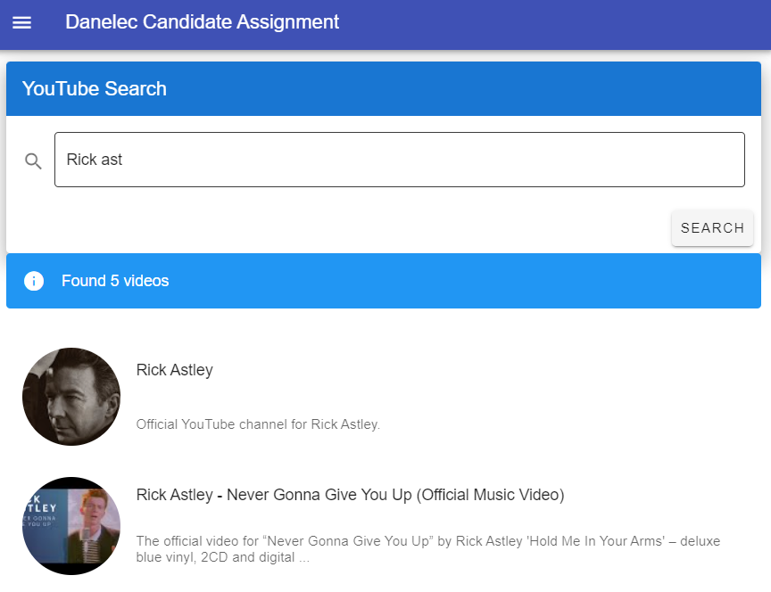

# Danelec Candidate Assignment

## YouTube Search

### The Assignment
1. Fix the broken application.
2. Comment on possible improvements to the code.
3. Document your work process.

### Setup
1. To run the code you need Node installed. It can be downloaded from here:
https://nodejs.org/
2. You’ll need Git as well: https://git-scm.com/download/win
3. When both Git and Node is installed, you can clone the repository and install npm
packages:
``` 
C:\git> git clone https://github.com/kyma-as/danelec-candidate-vue.git
C:\git> cd .\danelec-candidate-vue\
C:\git\danelec-candidate-vue> npm install
``` 
4. When that is done, the application can be started by running the command:
``` 
C:\git\danelec-candidate-vue> npm run serve
``` 
5. Assuming all went well, you can now start the assignment by opening  
http://localhost:8080/
6. A blank page is expected on first load!

### Resources
- Vue:  
  https://v2.vuejs.org/
- YouTube Search API:  
https://developers.google.com/youtube/v3/docs/search/list

## Expected Results
The following is expected

### Home Page



### YouTube Search Page



When clicking the image, the user is taken to YouTube where the video starts playing.

## Other information
- You are not expected to dig into the build process and how stuff works with live reload,
webpack, etc...
- Only some of the files beneath the `.\src` folder is relevant to solve the assignment.
- Your browser’s javascript *Console* and *Dev Tools* may be helpful.
